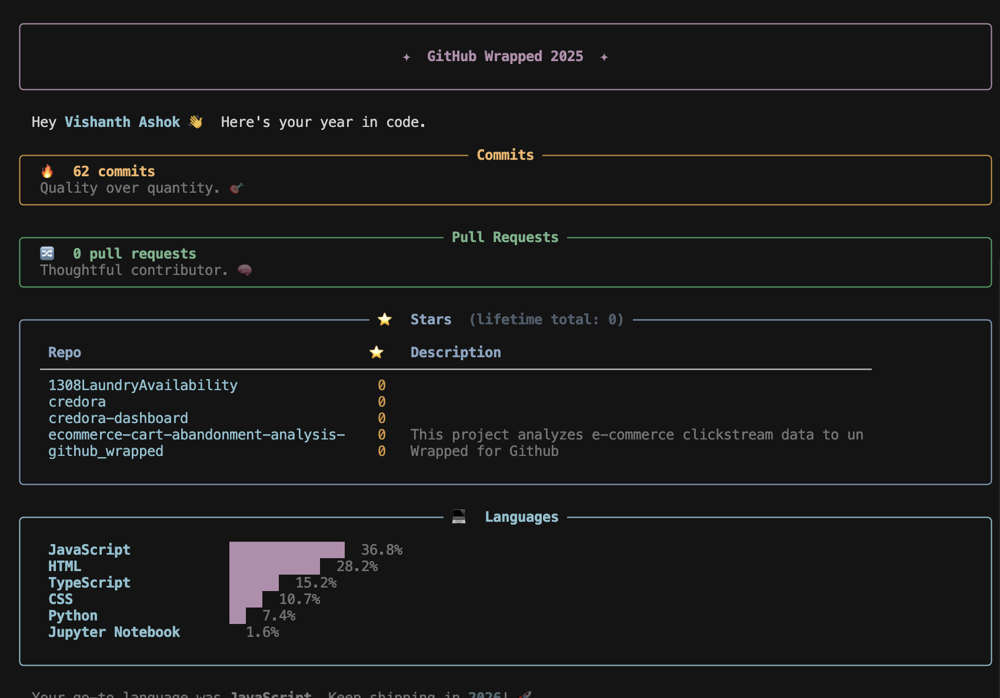

# 🎄 GitHub Wrapped

Discover your GitHub story with **GitHub Wrapped** – a Spotify Wrapped-inspired tool that visualizes and celebrates your contributions, coding habits, and GitHub journey throughout the year!

## 📊 What is GitHub Wrapped?

GitHub Wrapped is a Python-based application that analyzes your GitHub activity and generates a beautiful, personalized summary of your coding year. Similar to Spotify Wrapped, it provides insights into your most active projects, contribution patterns, coding languages, and more.

## 🎯 Features

- **Contribution Analytics**: View your total commits, pull requests, and issues created
- **Language Breakdown**: Discover which programming languages you used most
- **Repository Insights**: See your top repositories by activity
- **Activity Timeline**: Visualize your contributions throughout the year
- **Personalized Summary**: Get a unique, shareable summary of your GitHub stats

## 📸 Example

Check out what your GitHub Wrapped might look like:



## 🚀 Getting Started

### Prerequisites

- Python 3.7+
- GitHub Personal Access Token

### Installation

1. Clone the repository:
```bash
git clone https://github.com/vishanthashok/github_wrapped.git
cd github_wrapped
```

2. Install required dependencies:
```bash
pip install -r requirements.txt
```

3. Set up your GitHub Personal Access Token:
   - Go to [GitHub Settings → Developer Settings → Personal Access Tokens](https://github.com/settings/tokens)
   - Create a new token with `repo` and `read:user` scopes
   - Store your token securely

### Usage

Run the GitHub Wrapped analyzer:

```bash
python github_wrapped.py
```

Follow the prompts to:
1. Enter your GitHub username
2. Provide your personal access token
3. Specify the year you want to analyze (optional, defaults to current year)

The tool will generate your personalized GitHub Wrapped summary!

## 📈 What You'll Learn

- Your coding patterns and preferences
- Most frequently used programming languages
- Contribution trends throughout the year
- Most active repositories and projects
- Collaboration insights

## 🛠️ Built With

- **Python** - Core application logic
- **GitHub API** - Data retrieval and analysis
- **PIL/Pillow** - Image generation

## 📝 License

This project is licensed under the MIT License – see the LICENSE file for details.

## 🤝 Contributing

Contributions are welcome! Feel free to:
- Report bugs
- Suggest new features
- Submit pull requests

## ⭐ Show Your Support

If you enjoy GitHub Wrapped, please give it a star! Your feedback and support help make this project better.

## 💬 Feedback

Have ideas or suggestions? Open an issue or reach out on GitHub!

---

**Happy Coding! 🎉**